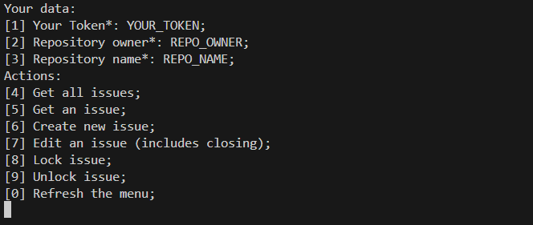

### IssueBuddy - CLI приложение, помогающее управлять Github Issues

--- 

#### Старт проекта

```go
cd cmd/app
go run main.go
```

---

#### Функциональность приложения (тема - анг. issue):

1) Просмотреть все темы репозитория;
2) Просмотреть одну тему репозитория;
3) Создать тему;
4) Отредактировать тему;
5) Закрыть/Открыть тему для обсуждений (lock/unlock);
6) Использовать желаемый текстовый редактор во время создания/редактирования темы.

---

#### Интерфейс программы




